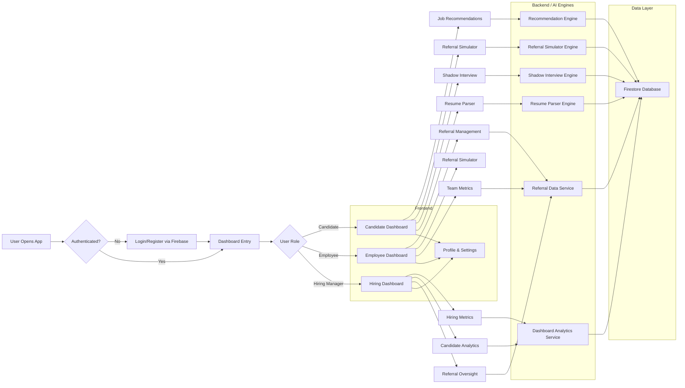

# REFHIRE

REFHIRE is an AI-powered referral and hiring platform that streamlines the employee referral process, provides intelligent job recommendations, simulates referral scenarios, conducts shadow interviews, and parses resumes. It aims to enhance hiring efficiency and employee engagement through data-driven insights.

## Tech Stack

### Backend
- **Python 3.x**
- **FastAPI**: Modern, fast web framework for building APIs
- **Uvicorn**: ASGI server for running FastAPI
- **Firebase Admin SDK**: For server-side Firebase operations
- **PyMuPDF**: For PDF processing (resume parsing)
- **python-multipart**: For handling file uploads
- **python-dotenv**: For environment variable management

### Frontend
- **React 19**: JavaScript library for building user interfaces
- **Vite**: Fast build tool and development server
- **Tailwind CSS**: Utility-first CSS framework
- **Firebase**: For authentication and real-time database
- **Lucide React**: Icon library
- **Motion**: Animation library for React
- **ESLint**: Code linting

### Database & Services
- **Google Cloud Firestore**: NoSQL cloud database
- **Firebase Authentication**: User authentication service

## Architecture

REFHIRE follows a client-server architecture with the following components:

1. **Frontend (React)**: Single-page application handling user interactions, authentication, and data visualization
2. **Backend (FastAPI)**: RESTful API server processing business logic, AI recommendations, and data operations
3. **Database (Firestore)**: Cloud-hosted NoSQL database for storing user data, job postings, referrals, and analytics
4. **AI Engines**: Specialized modules for recommendation algorithms, referral simulation, shadow interviews, and resume parsing

The architecture supports:
- RESTful API communication between frontend and backend
- Real-time data synchronization via Firebase
- Scalable cloud infrastructure
- Modular AI components for different hiring functionalities

## Workflow

The following flowchart illustrates the full application flow and all main feature interactions in REFHIRE:



## Project Structure

```
REFHIRE/
├── Backend/
│   ├── config.py                 # Application configuration
│   ├── main.py                   # FastAPI application entry point
│   ├── requirements.txt          # Python dependencies
│   ├── serviceAccountKey.json    # Firebase service account key (ignored)
│   ├── engines/                  # AI engine modules
│   │   ├── __init__.py
│   │   ├── recommendation_engine.py
│   │   ├── referral_simulator.py
│   │   ├── resume_parser.py
│   │   └── shadow_interview.py
│   ├── models/                   # Data models and schemas
│   │   ├── __init__.py
│   │   └── schemas.py
│   ├── routers/                  # API route handlers
│   │   ├── __init__.py
│   │   ├── dashboard.py
│   │   ├── interview.py
│   │   ├── recommendations.py
│   │   ├── resume.py
│   │   └── simulator.py
│   └── services/                 # Business logic services
│       ├── __init__.py
│       ├── auth.py
│       └── firestore_service.py
└── Frontend/
    ├── eslint.config.js          # ESLint configuration
    ├── firestore.indexes.json    # Firestore indexes
    ├── firestore.rules           # Firestore security rules
    ├── index.html                # HTML entry point
    ├── package.json              # Node.js dependencies and scripts
    ├── README.md                 # Frontend-specific README
    ├── vite.config.js            # Vite configuration
    ├── public/                   # Static assets
    └── src/
        ├── App.jsx               # Main React component
        ├── index.css             # Global styles
        ├── main.jsx              # React entry point
        ├── components/           # Reusable React components
        │   └── hiring/           # Hiring-specific components
        ├── contexts/             # React context providers
        │   └── AuthContext.jsx
        ├── firebase/             # Firebase configuration and utilities
        ├── pages/                # Page components
        └── services/             # API service functions
            └── api.js
```

## Installation

### Prerequisites
- Python 3.8 or higher
- Node.js 16 or higher
- npm or yarn
- Google Cloud account with Firestore enabled
- Firebase project

### Backend Setup

1. Navigate to the Backend directory:
   ```bash
   cd Backend
   ```

2. Create a virtual environment:
   ```bash
   python -m venv venv
   source venv/bin/activate  # On Windows: venv\Scripts\activate
   ```

3. Install dependencies:
   ```bash
   pip install -r requirements.txt
   ```

4. Set up environment variables:
   - Copy `.env.example` to `.env` (if exists) or create a `.env` file
   - Add necessary environment variables (e.g., Firebase config, API keys)

5. Place your Firebase service account key:
   - Download the service account key JSON from Firebase Console
   - Save it as `serviceAccountKey.json` in the Backend directory
   - **Important**: This file is already in `.gitignore` to prevent accidental commits

6. Run the backend server:
   ```bash
   python main.py
   ```

   The server will start on the port specified in `config.py` (default: likely 8000).

### Frontend Setup

1. Navigate to the Frontend directory:
   ```bash
   cd Frontend
   ```

2. Install dependencies:
   ```bash
   npm install
   ```

3. Set up Firebase configuration:
   - Create a `.env` file in the Frontend directory
   - Add your Firebase configuration variables:
     ```
     VITE_FIREBASE_API_KEY=your_api_key
     VITE_FIREBASE_AUTH_DOMAIN=your_auth_domain
     VITE_FIREBASE_PROJECT_ID=your_project_id
     VITE_FIREBASE_STORAGE_BUCKET=your_storage_bucket
     VITE_FIREBASE_MESSAGING_SENDER_ID=your_sender_id
     VITE_FIREBASE_APP_ID=your_app_id
     ```

4. Start the development server:
   ```bash
   npm run dev
   ```

   The frontend will be available at `http://localhost:5173` (default Vite port).

## Usage

1. Ensure both backend and frontend servers are running
2. Access the application through the frontend URL
3. Register/Login using Firebase Authentication
4. Use the various features:
   - Job recommendations
   - Referral simulator
   - Shadow interviews
   - Resume parsing
   - Hiring dashboard

## API Documentation

Once the backend is running, visit `http://localhost:<port>/docs` to access the interactive API documentation provided by FastAPI.

## Contributing

1. Fork the repository
2. Create a feature branch
3. Make your changes
4. Run tests and linting
5. Submit a pull request

## License

This project is licensed under the MIT License - see the LICENSE file for details.